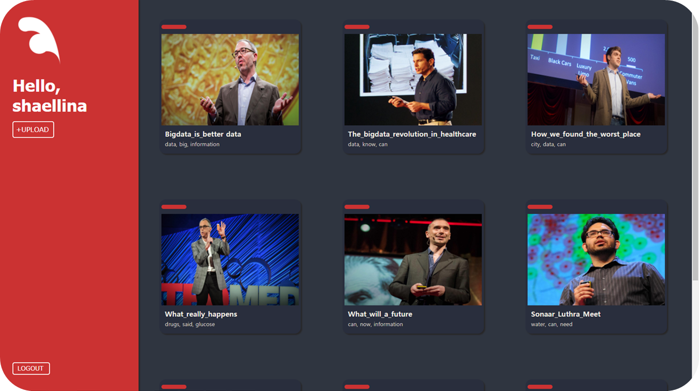

# CcoCcoTag
AI-BigData Inner Project

## Description
CcoCcoTag is a video tag recommendation service.
The indefinite number of tags that run the video are causing the search performance to deteriorate and confusing. 
So when I write a tag, I thought it would be good to suggest a keyword that I would like to write as a tag.

We used **JAVE** to change the video to Audio, **IBM watson's STT** to change the audio to Text, and **R** to create word count and word cloud.

## main
{: margin: 0 auto; display: block;}

## detail
{: margin: 0 auto; display: block;}

## References

[JAVE (Java Audio Video Encoder) library](http://www.sauronsoftware.it/projects/jave)

[IBM Watson API java sdk](https://github.com/watson-developer-cloud/java-sdk)
